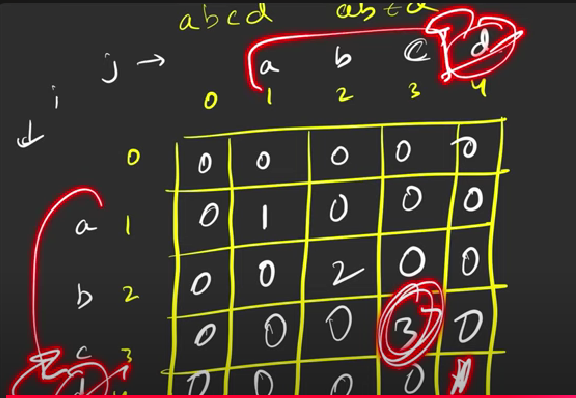

# Longest common substring
- A substring of a string is a subsequence in which all the characters are consecutive. Given two strings, we need to find the longest common substring.

- We need to print the length of the longest common substring.

### Logic


- 
### Recursion
```
int f(ind1, ind2)
{
    if(ind1<0 || ind2<0)
    {
        return 0;
    }
    if(s1[ind1]==s2[ind2])
    {
        return 1 + f(ind1-1,ind2-1);
    }
    return 0;
}
```
### Memoization
```
vector<vector<int>> dp(n,vector<int>(m,-1));
int f(ind1, ind2)
{
    int res;
    int ans=0;
    if(ind1<0 || ind2<0)
    {
        return 0;
    }
    if(dp[ind1][ind2]!=-1)
    {
        return dp[ind1][ind2];
    }
    if(s1[ind1]==s2[ind2])
    {
        res = 1 + f(ind1-1,ind2-1);
        ans=max(ans,res);
        return dp[ind1][ind2]=res;
    }
    else
    {
        return 0;
    }
    return ans;
}
```
- Time Complexity: O(n*m)(n and m are the lengths of s1 and s2 respectively)
- Space Complexity: O(n*m) + O(n*m) (Auxiliary stack space) (There can be N deletions from s1, and m deletions from s2)


### Tabulation
```
vector<vector<int>> dp(n+1,vector<int>(m+1,0));
int f()
{
    int ans=0;
    for(int i=1;i<=n;i++)
    {
        for(int j=1;j<=m;j++)
        {
            if(s1[i-1]==s2[j-1])
            {
                dp[i][j]=1+dp[i-1][j-1];
                ans = max(ans,dp[i][j]);
            }
            else
            {
                dp[i][j]=0;
            }
        }
    }
    return ans;
}
```
- Time Complexity: O(n*m)
- Space Complexity: O(n*m)


### Space Optimized
```
int f()
{
    int ans=0;
    vector<int> prev(m+1,0);
    for(int i=1;i<=n;i++)
    {
        vector<int> temp(m+1,0);
        for(int j=1;j<=m;j++)
        {
            if(s1[i-1]==s2[j-1])
            {
                temp[j]=1+prev[j-1];
                ans=max(ans,temp[j]);
            }
            else
            {
                temp[j]=0;
            }
        }
        prev=temp;
    }
    return ans;
}
```
- Time Complexity: O(n*m)
- Space Complexity: O(m)
