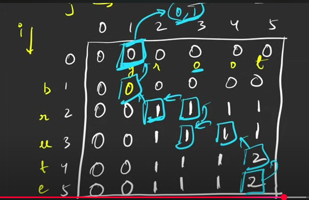

# Shortest common supersequence

### Logic:
- Length of shortest common supersequence: N+M-LCS


### Base case:
- Out of boundary.

### Recursion
```
int f(ind1, ind2)
{
    if(ind1<0 || ind2<0)
    {
        return 0;
    }

    if(s1[ind1]==s2[ind2])
    {
        return 1 + f(ind1-1,ind2-1);
    }
    int l = f(ind1-1,ind2);
    int r = f(ind1,ind2-1);
    return max(l,r);
}
int main()
{
    string s1, s2;
    int lcs = f(n-1,m-1);
    int scs = n+m-lcs;
    int i=n;
    int j=m;
    string ans="";
    
    while(i>0 && j>0)
    {
        if(s1[i-1]==s2[j-1])
        {
            ans+=s1[i-1];
            i--;
            j--;
        }
        else if(f(i-1,j)>f(i,j-1))
        {
            ans+=s1[i-1];
            i--;
        }
        else
        {
            ans+=s2[j-1];
            j--;
        }
    }
    while(i>0)
    {
        ans+=s1[i-1];
        i--;
    }
    while(j>0)
    {
        ans+=s2[j-1];
        j--;
    }
    reverse(ans.begin(),ans.end());
    cout << ans ;
}


```
- Time Complexity: O((2^n)*(2^m))(n and m are the lengths of s1 and s2 respectively)
- Space Complexity: O(m+n)

- Here, we have overlapping subproblem. So, can be optimized using DP.
### Memoization
```
vector<vector<int>> dp(n,vector<int>(m,-1));
int f(ind1, ind2)
{
    if(ind1<0 || ind2<0)
    {
        return 0;
    }
    if(dp[ind1][ind2]!=-1)
    {
        return dp[ind1][ind2];
    }
    if(s1[ind1]==s2[ind2])
    {
        return dp[ind1][ind2]=1 + f(ind1-1,ind2-1);
    }
    int l = f(ind1-1,ind2);
    int r = f(ind1,ind2-1);
    return dp[ind1][ind2]=max(l,r);
}
int main()
{
    string s1, s2;
    int lcs = f(n-1,m-1);
    int scs = n+m-lcs;
    int i=n;
    int j=m;
    string ans="";
    
    while(i>0 && j>0)
    {
        if(s1[i-1]==s2[j-1])
        {
            ans+=s1[i-1];
            i--;
            j--;
        }
        else if(dp[i-1][j]>dp[i][j-1])
        {
             ans+=s1[i-1];
            i--;
        }
        else
        {
             ans+=s2[j-1];
            j--;
        }
    }
    while(i>0)
    {
        ans+=s1[i-1];
        i--;
    }
    while(j>0)
    {
        ans+=s2[j-1];
        j--;
    }
    reverse(ans.begin(),ans.end());
    cout << ans ;
}

```
- Time Complexity: O(n*m)(n and m are the lengths of s1 and s2 respectively)
- Space Complexity: O(n*m) + O(n*m) (Auxiliary stack space) (There can be N deletions from s1, and m deletions from s2)
 
### Steps for memoization to tabulation:
1. Copy the base case
2. Write changing parameters in opposite fashion
3. Copy the recurrence.

Here, we do shifting of index, to include base case in tabulation method.


### Tabulation
```
vector<vector<int>> dp(n+1,vector<int>(m+1,0));
int f()
{
    for(int i=1;i<=n;i++)
    {
        for(int j=1;j<=m;j++)
        {
            if(s1[i-1]==s2[j-1])
            {
                dp[i][j]=1+dp[i-1][j-1];
            }
            else
            {
                dp[i][j]=max(dp[i-1][j],dp[i][j-1]);
            }
        }
    }
    return dp[n][m];
}
int main()
{
    string s1, s2;
    int lcs = f(n-1,m-1);
    int scs = n+m-lcs;
    int i=n;
    int j=m;
    string ans="";
    
    while(i>0 && j>0)
    {
        if(s1[i-1]==s2[j-1])
        {
            ans+=s1[i-1];
            i--;
            j--;
        }
        else if(dp[i-1][j]>dp[i][j-1])
        {
            ans+=s1[i-1];
            i--;
        }
        else
        {
            ans+=s2[j-1];
            j--;
        }
    }
    while(i>0)
    {
        ans+=s1[i-1];
        i--;
    }
    while(j>0)
    {
        ans+=s2[j-1];
        j--;
    }
    reverse(ans.begin(),ans.end());
    cout << ans ;
}
```
- Time Complexity: O(n*m)
- Space Complexity: O(n*m)

### Space Optimized
```
int f()
{
    vector<int> prev(m+1,0);
    for(int i=1;i<=n;i++)
    {
        vector<int> temp(m+1,0);
        for(int j=1;j<=m;j++)
        {
            if(s1[i-1]==s2[j-1])
            {
                temp[j]=1+prev[j-1];
            }
            else
            {
                temp[j]=max(prev[j],prev[j-1]);
            }
        }
        prev=temp;
    }
    return prev[m];
}
int main()
{
    string s1, s2;
    int lcs = f(n-1,m-1);
    int scs = n+m-lcs;
    int i=n;
    int j=m;
    string ans="";
    
    while(i>0 && j>0)
    {
        if(s1[i-1]==s2[j-1])
        {
            ans+=s1[i-1];
            i--;
            j--;
        }
        else if(dp[i-1][j]>dp[i][j-1])
        {
            ans+=s1[i-1];
            i--;
        }
        else
        {
            ans+=s2[j-1];
            j--; 
        }
    }
    while(i>0)
    {
        ans+=s1[i-1];
        i--;
    }
    while(j>0)
    {
        ans+=s2[j-1];
        j--;
    }
    reverse(ans.begin(),ans.end());
    cout << ans ;
}
```
- Time Complexity: O(n*m)
- Space Complexity: O(m)
