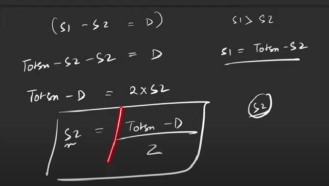

# Count partitions with given difference

- We are given an array. Partition it into 2 subsets (possibly empty) such that their union is the original array. Let the sum of the elements of these 2 subsets be S1 and S2.
- Given a difference D, count the number of partitions in which S1 is greater then or equal to S2 and the difference between S1 and S2 is equal to D. Since the answer may be too large, return it modulo "10^9 + 7".

## Constraints:
- A[i]>0
- TotalSum >=D

### Logic

- Here, we need to find the count of subsets with sum calculated as above.

### Recursion
```
int mod = (int)(1e9+7);
int f(ind, target)
{
    if(target==0)
    {
        return 1;
    }
    if(ind==0)
    {
        return target==A[ind] ? 1 : 0;
    }
    int notTake = f(ind-1,target);
    int take=0;
    if(A[ind]<=target)
    {
        take = f(ind-1,target-A[ind]);
    }
    return (notTake + take)%mod;
}
int main()
{
    int sum=0;
    for(int i=0;i<N;i++)
    {
        sum+=A[i];
    }
    if((sum-D)<0 || (sum-D)%2!=0)
    {
        cout << false;
    }
    f(N-1, (sum-D)/2);
}
```
- Time Complexity: O(2^N)
- Space Complexity: O(N) (Recursive stack space)


### Memoization
```
int mod = (int)(1e9+7);
vector<vector<int>> dp(n,vector<int>(target+1,-1));
int f(ind, target)
{
    if(target==0)
    {
        return dp[ind][target]= 1;
    }
    if(ind==0)
    {
        return dp[ind][target]=target==A[ind] ? 1 : 0;
    }
    if(dp[ind][target]!=-1)
    {
        return dp[ind][target];
    }
    int notTake = f(ind-1,target);
    int take=0;
    if(A[ind]<=target)
    {
        take = f(ind-1,target-A[ind]);
    }
    return dp[ind][target]=(notTake + take)%mod;
}
int main()
{
    int sum=0;
    for(int i=0;i<N;i++)
    {
        sum+=A[i];
    }
    if((sum-D)<0 || (sum-D)%2!=0)
    {
        cout << false;
    }
    f(N-1, (sum-D)/2);
}
```
- Time Complexity: O(N*target)
- Space Complexity: O(N*target) +O(N) (Recursive stack space)


### Tabulation
```
int mod = (int)(1e9+7);
vector<vector<int>> dp(n,vector<int>(target+1,0));
int f()
{
    for(int i=0;i<N;i++)
    {
        dp[i][0]=1;
    }
    if(A[0]<=target)
    {
        dp[0][A[ind]]=1;
    }
    for(int i=1;i<N;i++)
    {
        for(int j=1;j<=target;j++)
        {
            int notTake = dp[i-1][j];
            int take=0;
            if(A[i]<=j)
            {
                take = dp[i-1][j-A[i]];
            }
            dp[i][j]=(notTake + take)%mod;
        }
    }
    return dp[N-1][target];
}
int main()
{
    int sum=0;
    for(int i=0;i<N;i++)
    {
        sum+=A[i];
    }
    if((sum-D)<0 || (sum-D)%2!=0)
    {
        cout << false;
    }
    f(N-1, (sum-D)/2);
}

```
- Time Complexity: O(N) + O(N*target)
- Space Complexity: O(N*target)


### Space Optimized

```
int mod = (int)(1e9+7);

int f()
{
    vector<int> prev(target+1,0);
    prev[0]=1;
    if(A[0]<=target)
    {
        prev[A[ind]]=1;
    }
    for(int i=1;i<N;i++)
    {
        vector<int> temp(target+1,0);
        temp[0]=1;
        for(int j=1;j<=target;j++)
        {
            int notTake = prev[j];
            int take=0;
            if(A[i]<=j)
            {
                take = prev[j-A[i]];
            }
            temp[j]=(notTake + take)%mod;
        }
        prev=temp;
    }
    return prev[target];
}
int main()
{
    int sum=0;
    for(int i=0;i<N;i++)
    {
        sum+=A[i];
    }
    if((sum-D)<0 || (sum-D)%2!=0)
    {
        cout << false;
    }
    f(N-1, (sum-D)/2);
}

```
- Time Complexity: O(N) + O(N*target)
- Space Complexity: O(target)


## Constraints:
- A[i] can be 0 as well

### Tabulation:
```
int mod = (int)(1e9+7);
vector<vector<int>> dp(n,vector<int>(target+1,0));
int f()
{
    if(A[0]==0)
    {
        dp[0][0]=2;
    }
    else
    {
        dp[0][0]=1;
    }
    if(A[0]!=0 && A[0]<=target)
    {
        dp[0][A[0]]=1;
    }
    for(int i=1;i<N;i++)
    {
        for(int j=1;j<=target;j++)
        {
            int notTake = dp[i-1][j];
            int take=0;
            if(A[i]<=j)
            {
                take = dp[i-1][j-A[i]];
            }
            dp[i][j]=(notTake + take)%mod;
        }
    }
    return dp[N-1][target];
}
int main()
{
    int sum=0;
    for(int i=0;i<N;i++)
    {
        sum+=A[i];
    }
    if((sum-D)<0 || (sum-D)%2!=0)
    {
        cout << false;
    }
    f(N-1, (sum-D)/2);
}

```
- Time Complexity: O(N) + O(N*target)
- Space Complexity: O(N*target)

### Space optimized

```
int mod = (int)(1e9+7);

int f()
{
    vector<int> prev(target+1,0);

    if(A[0]==0)
    {
        prev[0]=2;
    }
    else
    {
        prev[0]=1;
    }
    if(A[0]!=0 && A[0]<=target)
    {
        prev[A[0]]=1;
    }
    for(int i=1;i<N;i++)
    {
        vector<int> temp(target+1,0);
        for(int j=1;j<=target;j++)
        {
            int notTake = prev[j];
            int take=0;
            if(A[i]<=j)
            {
                take = prev[j-A[i]];
            }
            temp[j]=(notTake + take)%mod;
        }
        prev=temp
    }
    return prev[target];
}
int main()
{
    int sum=0;
    for(int i=0;i<N;i++)
    {
        sum+=A[i];
    }
    if((sum-D)<0 || (sum-D)%2!=0)
    {
        cout << false;
    }
    f(N-1, (sum-D)/2);
}

```
- Time Complexity: O(N) + O(N*target)
- Space Complexity: O(target)