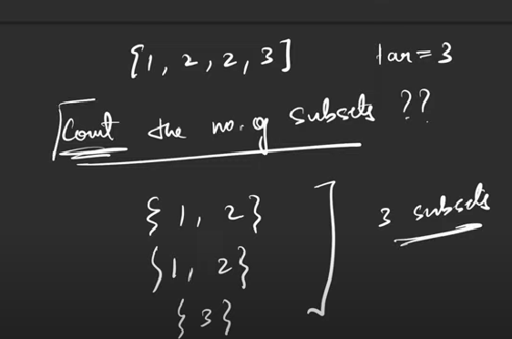

# Count subsets with sum K
- You are given an array of positive integers and you have to tell how many different ways of selecting the elements from the array are there such that the sum of chosen elements is equal to the number target.



### Constraints:
1. 1<=T<=10
2. 1<=N<=100
3. 1<=A[i]<=1000
4. 1<=target<=1000

### Logic:
- Whenever we have are asked about the count in the questions, in the base case, if the condition is satisfied, we return 1, or else 0.
- As the target value is also changing, we have 2 parameters, index and target.
- As we have this keyword "count" mentioned in the questions, we need to return sum of all the possibilities.
-'f(ind,target)': it means that this will return the count of subsequences/subsets with sum equal to target, for the index range [0, ind].


## Steps :

### Steps for recursion:
1. Express in terms of (ind, target)
2. Explore all the possibilities.
3. Sum all of the possibilities and return.

### Steps for Tabulation:
1. Write the base case
2. Look at the changing parameters and write he nested loops.
3. copy recursion.

### Recursion
```
int f(ind, target)
{
    if(target==0)
    {
        return 1;
    }
    if(ind==0)
    {
        return target==A[ind] ? 1 : 0;
    }
    int notTake = f(ind-1,target);
    int take=0;
    if(A[ind]<=target)
    {
        take = f(ind-1,target-A[ind]);
    }
    return notTake + take;
}
```
- Time Complexity: O(2^N)
- Space Complexity: O(N) (Recursive stack space)

### Memoization
```
vector<vector<int>> dp(n,vector<int>(target+1,-1));
int f(int,target)
{
    if(target==0)
    {
        return dp[ind][target]=1;
    }
    if(ind==0)
    {
        return dp[ind][target]= target==A[ind] ? 1 : 0;
    }
    if(dp[ind][target]!=-1)
    {
        return dp[ind][target];
    }
    int notTake = f(ind-1,target);
    int take=0;
    if(A[ind]<=target)
    {
        take = f(ind-1,target-A[ind]);
    }
    return dp[ind][target]=notTake + take;
}

```
- Time Complexity: O(N*target)
- Space Complexity: O(N*target) + O(N) (Auxiliary stack space)


### Tabulation
```
vector<vector<int>> dp(n,vector<int>(target+1,0));
int f()
{
    for(int i=0;i<N;i++)
    {
        dp[i][0]=1;
    }
    if(A[0]<=target)
    {
        dp[0][A[ind]]=1;
    }
    for(int i=1;i<N;i++)
    {
        for(int j=1;j<=target;j++)
        {
            int notTake = dp[i-1][j];
            int take=0;
            if(A[i]<=j)
            {
                take = dp[i-1][j-A[i]];
            }
            dp[i][j]=notTake + take;
        }
    }
    return dp[N-1][target];
}

```
- Time Complexity: O(N*target) + O(N)
- Space Complexity: O(N*target)


### Space Optimized
```
int f()
{
    vector<int> prev(target+1,0);
    prev[A[0]]=1;
    prev[0]=1;
    for(int i=1;i<N;i++)
    {
        vector<int> temp(target+1,0);
        temp[0]=1;
        for(int j=1;j<=target;j++)
        {
            int notTake = prev[j];
            int take=0;
            if(A[i]<=j)
            {
                take = prev[j-A[i]];
            }
            temp[j]=notTake + take;
        }
        prev=temp;
    }
    return prev[target];
}

```
- Time Complexity: O(N*target) 
- Space Complexity: O(target)


- Suppose, if we ignore the constraints, and the possible value of A[i] can also be 0, then the code can be optimized as below:

```
vector<vector<int>> dp(n,vector<int>(target+1,-1));
int f(int,target)
{
    
    if(ind==0)
    {
        if(target==0 && A[0]==0)
        {
            return 2;
        }
        if(target==0 || target==A[0])
        {
            return 1;
        }
        return 0;
    }
    if(dp[ind][target]!=-1)
    {
        return dp[ind][target];
    }
    int notTake = f(ind-1,target);
    int take=0;
    if(A[ind]<=target)
    {
        take = f(ind-1,target-A[ind]);
    }
    return dp[ind][target]=notTake + take;
}

```
- Time Complexity: O(N*target)
- Space Complexity: O(N*target) + O(N) (Auxiliary stack space)

