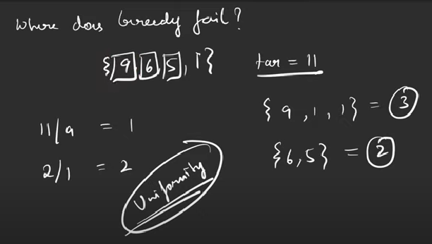

# Minimum coins
- We are given a target sum of ‘X’ and ‘N’ distinct numbers denoting the coin denominations. We need to tell the minimum number of coins required to reach the target sum. We can pick a coin denomination for any number of times we want.

### Logic
- Here, we can either use DP or greedy. But, greedy approach will fail due to the absence of uniformity in the values.

- So, we go with the DP approach.
- Whenever we have infinite supply/multiple use, in the pick condition, we retain the value of index, instead of reducing it by 1.

### Recursion
```
int f(ind,target)
{
   
    if(ind==0)
    {
        return (target%coin[ind]==0) ? (target)/(coin[ind]) : 1e9;
    }
    int notTake = f(ind-1,target);
    int take = 1e9;
    if(coin[ind]<=target)
    {
        take = 1 + f(ind, target-coin[ind]);
    }
    return min(notTake, take);
}
```
- Time Complexity: O(2^N)
- Space Complexity: O(target) (Recursive stack space)(this is due to change in pick condition)

### Memoization
```
vector<vector<int>> dp(N,vector<int>(target+1,INT_MAX));
int f(ind,target)
{
   
    if(ind==0)
    {
       return (coin[ind]==target || target%coin[ind]==0) ? (target)/(coin[ind]) : 1e9;
    }
    if(dp[ind][target]!=INT_MAX)
    {
        return dp[ind][target];
    }
    int notTake = f(ind-1,target);
    int take = INT_MAX;
    if(coin[ind]<=target)
    {
        take = 1 + f(ind, target-coin[ind]);
    }
    return dp[ind][target]=min(notTake, take);
}
```
- Time Complexity: O(N*target)
- Space Complexity: O(N*target) (DP Array) + O(target) (Auxiliary stack space)

### Tabulation
```
vector<vector<int>> dp(N,vector<int>(target+1,INT_MAX));
int f()
{
    
    for(int i=0;i<=target;i++)
    {
        if(target%coin[0]==0)
       {
          dp[0][target]=target/coin[0];
       }
    }
    
    for(int i=1;i<N;i++)
    {
        for(int j=0;j<=target;j++)
        {
            int notTake = dp[i-1][j];
            int take = INT_MAX;
            if(coin[i]<=j)
            {
                take = 1 + dp[i][j-coin[i]];
            }
            dp[i][j]=min(notTake, take);
        }
    }
    return dp[N-1][target];
}
```
- Time Complexity: O(N) + O(N*target)
- Space Complexity: O(N*target)

### Space Optimized
```
int f()
{
    vector<int> prev(target+1,INT_MAX);

    for(int i=0;i<=target;i++)
    {
        if(target%coin[0]==0)
       {
          prev[target]=target/coin[0];
       }
    }
    for(int i=1;i<N;i++)
    {
        vector<int> temp(target+1,INT_MAX);
        temp[0]=0;
        for(int j=0;j<=target;j++)
        {
            int notTake = prev[j];
            int take = INT_MAX;
            if(coin[i]<=j)
            {
                take = 1 + temp[j-coin[i]];
            }
            temp[j]=min(notTake, take);
        }
        prev=temp;
    }
    return prev[target];
}
```
- Time Complexity: O(N) + O(N*target)
- Space Complexity: O(target)

