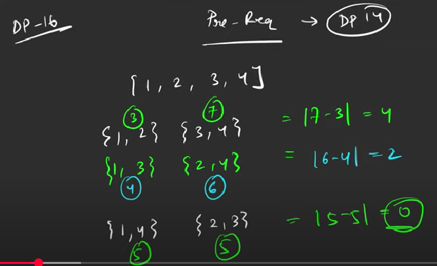

# Partition a set into 2 subsets with minimum absolute sum difference:
- You are given an array containing N integers. Your task is to partition this array into 2 subsets, such that the absolute difference between subset sum is minimum.
- You just need to find the minimum absolute difference considering any valid division of the array elements.


 

### Logic:

-  Here, we will use the code for "Subset sum equal to target". For every possible value of target and index, we will find if it is possible to get the subset sum equal to the given target value. 
- For last row, i.e., for the index N-1, we have all the results, if the target sum is possible or not.
- For the values, if the value is array is true, the target sum is possible. This sum will be one subset sum, s1. Another can be found as s2=s-s1.
- The expression which needs to be minimized is: |s-2*s1|
- Now, for all possible values in last row, lets find this expression, anf return the min from them.

### Space Optimized
```
int f()
{ 
    int target=0;
    for(int i=0;i<N;i++)
    {
        target+=A[i];
    }
    vector<int> prev(target+1,0);
    prev[0]=1;
    if(target>=A[0])
    {
        prev[A[0]]=1;
    }
    for(int i=1;i<N;i++)
    {
        vector<int> temp(target+1,0);
        temp[0]=1;
        for(int j=1;j<=target;j++)
        {
            int notTake = prev[j];
            int take=0;
            if(j>=A[i])
            {
                take = prev[j-A[i]];
            }
            temp[j]= notTake || take;
        }
        prev=temp;
    }
    int mn=INT_MAX;
    for(int i=0;i<=(target/2);i++)
    {
       if(prev[i]==1)
       {
         mn=mn(min,abs(target-2*i));
       }
    }
    return mn;
    
}
```
- Time Complexity: O(N) + O(N*target) + O(target)
- Space Complexity: O(target)

