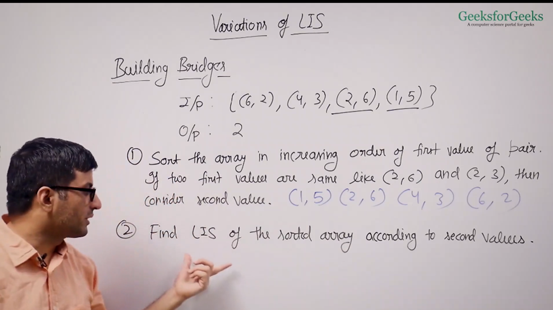

# Longest Increasing Subsequence
-  Subsequence of a sequence can be obtained by picking 0 or more elements from a sequence
- Picked elements in the subsequence should appear in the same order as they appear in the original sequence
- If n is the length of any sequence. Then there is total 2^n total possible subsequence.


### Naive solution:
- Find all the subsequence, find which of them is increasing subsequence. And then the one with the maximum length is the answer.


### Tabulation
- Here, we find the longest increasing subsequence ending with a particular element.
- We store length of such subsequence in array
- Longest increasing subsequence doesn’t have to end with the last element, it can end before as well.
```
int lis(int arr[], int n)
{
    int lis[n];
    lis[0]=1;
    for(int i=1;i<n;i++)
    {
        lis[i]=1;
        for(int j=0;j<i;j++)
        {
            if(arr[j]<arr[i])
            {
                lis[i]=max(lis[i],lis[j]+1);
            }
        }
    }
    int res;
    for(int i=0;i<n;i++)
    {
        res = max(res,lis[i]);
    }
    return res;
}
```
- Time Complexity: theta(n^2)
- Space Complexity: theta(n)

- There is a better solution which can be implemented with theta(n*log n) time complexity, using binary search.

### Optimized

- here, we store the minimum possible tail value for every LIS of length (i+1)
- We use binary search to find the ceiling element in the array. i.e., where the element can be inserted in the array.
- Here, if the element in array is grater than the last stored element in tail array, just append it. If it is not, then just find the position where it can be inserted, and replace it with the element already present there.

```
int ceilIdx(int tail[], int s, int e, int x)
{
    while(s<e)
    {
        int m = s + (e-s)/2;
        if(tail[m]>=x)
        {
            e=m;
        }
        else
        {
            s=m+1;
        }
    }
    return r;
}
int lis(int arr[], int n)
{
    int tail[n];
    int len=1;
    tail[0]=arr[0];
    for(int i=1;i<n;i++)
    {
        if(arr[i]>tail[len-1])
        {
            tail[len]=arr[i];
            len++;
        }
        else
        {
            int c = ceilIdx(tail, 0, len-1,arr[i]);
            tail[c]=arr[i];
        }
    }
    return len;
}
```
- Time Complexity: O(nlog n)
- Space Complexity: theta(n)

## Variations of LIS:
1. Minimum deletions to make array sorted
   - Find LIS
   - Return array length-LIS
2. Maximum sum increasing subsequence
   - Among all the subsequences, we need to find the one with maximum sum.

```
int msum[n];
for(int i=0;i<n;i++)
{
    msum[i]=arr[i];
    for(int j=0;j<i;j++)
    {
        if(arr[j]<arr[i])
        {
            msum[i]=max(msum[i],msum[j]+arr[i]);
        }
    }
}
int res=msum[0];
for(int i=1;i<n;i++)
{
    res=max(res,msum[i]);
}
return res;
```
3. Maximum length of bitonic subsequence
   - Bitonic subsequence = subsequence which is first increasing and then decreasing
   - Increasing or decreasing can also be empty
   - Arrays sorted in increasing or decreasing order can also be considered as bitonic sequence.
   - We will do the same procedure as we did to find the LIS to get the list, but in the reverse direction. We get the longest decreasing subsequence
   - For every pivot I, we find the lis[i]+lds[i]-1, and answer will be the maximum value of the expression for all i’s
   - Time Complexity: O(n^2)
   - Space Complexity: theta(n)
   - We can optimize above solution to O(nlogn) time complexity, using binary search.

4. Building bridges:
   - We are given an array of pair of cities.
   - These pairs represent the requirement for the bridge
   - But the condition is that no 2 bridges should cross each other.
   - We want to maximize the number if bridges we can make.


   Steps:
   a. Sort the array in increasing order of the first value of pair. If the 2 first values are same, then consider second value.
   b. Find the LIS of the sorted array according to the second value.
   
   - Time Complexity: sorting (O(nlog n)) + LIS (O(nlog n)) = O(nlog n)

5. Longest chain of pairs:
   - We are given array of pairs
   - First element of every pair is smaller than second element of every pair.
   - We need to form the longest chain pf pairs such that suppose if we have 2 pairs (a,b) and (c,d)
   - Then to form the chain b must be smaller than c

   Steps:
   a. Sort the array of pairs according to the first value
   b. Find the LIS of the sorted array

   - This is the acivity selection problem.
   
