# Basics

## What is system design:

- Vertical Scaling: Optimize processes and increase throughput using the same resources
- Resilience: Recovering from failures quickly
- Preprocessing using cron jobs: Preparing beforehand during non-peak hours
- Backup server: Keep backups and avoid single point of failure (Master slave architecture for databases or servers)
- Horizontal scaling: Hire more resources

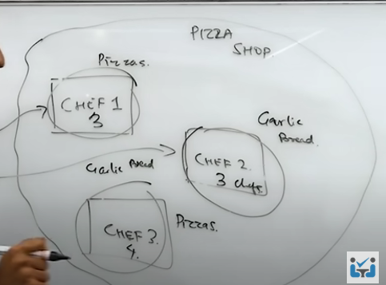

- Microservice architecture: Make separate services based on feature or specialty. Here, we have well defined responsibilities, and we don't have anything outside of the business use case that we handle for each service. 
- Distributed systems (partitioning): When the system is not working, due to some reasons, we should have a backup, like the distributed system. In case of failure, the requests will be routed to the backup system. This is known as fault tolerance. The users are spread all around the world. So, in order to given the quick response, we need local systems/ servers everywhere. This is done by this. 

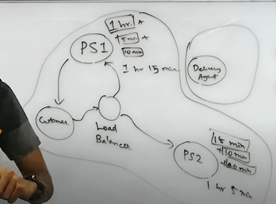

- Load Balancer: Customer sends the request, it has to be routed to one of the servers/ systems. Depending upon the response time from the servers, the request will be routed to the one with quick response time. This is done by load balancer.

- Decoupling: Here, we can see the separation of responsibilities in order to handle the separate systems more efficiently.

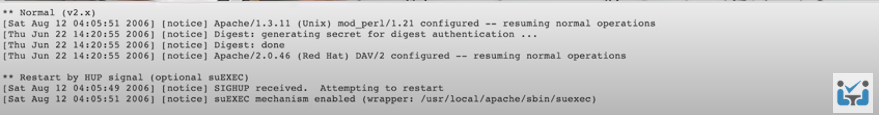

- Logging and Metric calculation: We can observe the events and processes occurring using this.
- Extensible:  We should be able to extend the system features and functionality.

### High Level Design:
- It involves deploying on servers, figuring out how 2 systems will interact with each other.
1. Overload: Horizontal scaling
2. Complexity: Separation of concerns or responsibilities
3. Mishaps: Fault tolerance

### Low Level Design:
- It involves the way we implement the system in code like making classes, objects, functions etc.

## Horizontal vs. Vertical scaling:

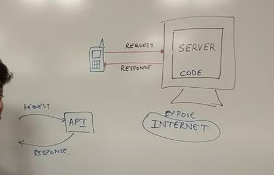

- We have written a code, accepting the request and returning the response. We want to expose our code to others using protocol which will run on the internet.
- We will be exposing our code using API(Application Programming Interface).
- Here, the API will receive the request and will return the corresponding response.
- Here, we might need the database connected to it (Its within the desktop itself), the endpoints through which it is being accessed needs to be configured. 

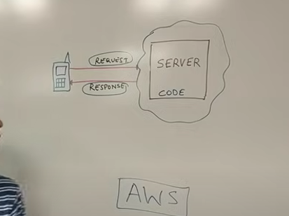

- We also needs to deal downtime situation, like power loss or any other. In order to deal with this, we can host our service on cloud. There is not much difference between cloud and on-premise setup. Cloud is a set of computers which is provided to us, with pay as you go service like AWS, Azure, and GCP etc.
- Cloud provides computation power. It is the desktop provided to us, which will be able to run our code or algorithm. We can store our code or algorithm in it, using the remote desktop login. It is not just single desktop, but a set of computers which we can use to run our service.
- We migrate our code or algorithms to cloud, because of the configurations, settings, reliability is taken care of to large extent by the cloud solution provider .
- Now that we have our server hosted on the cloud, we can focus more on the business requirements.

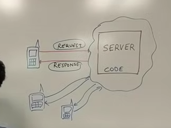

- Let's say, the number of users using our service has increased drastically. And our service is not able to handle these many connections.
- The solution to this is to introduce scalability. Below are the mechanisms using which we can increase the scalability: 
  a. One of the solutions for this is to buy a bigger machine (Vertical scaling)
  b. Another solution is to buy more number of machines (Horizontal scaling).
- Scalability: The ability to handle more requests by buying more machines, or by buying bigger machines is known as scalability.

### Horizontal Scaling:

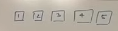

- Here, we need load balancing. 
- Resilient: As there are more than one machines, if one of the machines fails, we can redirect the request to others.
- Network calls(RPC- Remote Procedure Calls): Communication between the servers will be over the network. And network can be slow.
- Data Inconsistency: Suppose, there occurs transaction between 2 or more of the servers. The, it becomes complicated to maintain the data.
- It scales well. The amount of servers we throw at the problem is linear in terms of the number of users. It scales well as the number os users increases.

### Vertical scaling:

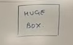

- Here, we have only one machine. So, we don't need a load balancer.
- Single point of failure: As there is only one machine present, there is single point of failure.
- Here, we have inter-process communication. So, it is quiet fast.
- As all the data resides only on 1 system, it is consistent.
- Here, we have a hardware limit.

- The major considerations we have while designing a system are: scalability, resiliency, consistency. With these qualities, we will have some of the tradeoffs, that's what is the system design.

## What is capacity estimation:

### Estimate YouTube's daily video storage requirements:

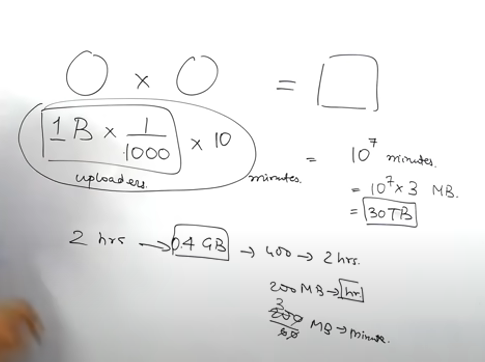
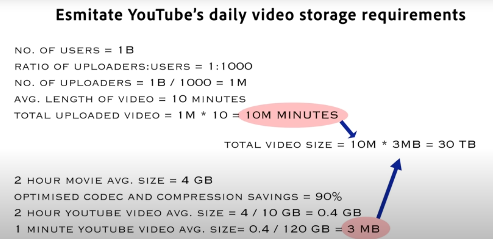
- Let's suppose, YouTube has 1 billion users. Let's say, 1 out of 1000 users, upload the videos. Each video is 10 minutes long. 
- Normally, 2 hours movie is 4GB in size. For low quality, it can become 04 GB. Using this, we can calculate the storage required for the 10 minute long video.
- So, the approximate amount og storage required to keep the raw footage of youtube on storage disk is 30TB. This is just one copy.
- In case of any failure, we might loose the data. It is the single point of failure. We need to implement data redundancy for fault tolerance as well as for the performance.
- If we have one copy of it in each of the regions like India, US etc., it will be easy for users to access it. And it will also be faster.
- Suppose we are making in total 3 copies for fault tolerance and data redundancy, the total storage will be 90TB.
- This storage is calculated for low resolution. We want to store the videos for multiple resolutions.

## What are HTTP and HTTPS protocols:

### HTTP:
- HyperText Transfer Protocol(HTTP) is an application layer protocol that is used to access and transfer data(text, images, video, multimedia, etc) over the world wide web.
- HTTP is a client-server protocol that runs on top of the TCP/IP family of protocols and uses the request/response protocol.
- HTTP uses port number 80. 
- In HTTP, the client sends a request message to the server. After the client responds, HTTP establishes a TCP connection between the client and the server. HTTP delivers a request to the server, which collects the data that was requested. After the server sends data to the client, the connection will be terminated.
- If we want something else from the server, we should have to re-establish the connection between client and server.

### Features of HTTP:
- HTTP is connectionless: After serving a single HTTP request, the client-server connection is closed and that same connection is never used again.
- HTTP is media independent: It means that HTTP can send any sort of data as long as both the client and the server understand how to process the data.
- HTTP is stateless: The client and server only know about each other during the current request, and when the connection is disconnected, both the client and the server forget about each other.

### HTTPS:
- Hypertext Transfer Protocol Secure is a secure extension or version of HTTP that is used for providing security to the data sent over the world wide web.

- This protocol allows transferring the data in an encrypted form which is particularly important when users transmit sensitive data such as login credentials.

- To encrypt communications HTTPS uses an encryption protocol called Transport Layer Security (TLS), formerly known as Secure Sockets Layer (SSL). 

- HTTPS protocol uses the 443 port number for communicating the data.

## What is SSL:
- Secure Sockets Layer (SSL) is a security protocol that provides privacy, authentication, and integrity to Internet communications. SSL eventually evolved into Transport Layer Security (TLS).
- Secure Sockets Layer (SSL) is a security protocol that provides privacy, authentication, and integrity to Internet communications. SSL eventually evolved into Transport Layer Security (TLS).

## Explain TCP/IP model:

- TCP: Transmission Control Protocol
- IP: Internet Protocol

- Transmission Control Protocol/Internet Protocol(TCP/IP) is a practical network model developed by the Department of Defense (DoD) in the 1960s to support communication between different network devices on the internet. 
- TCP is a set of communication protocols that supports network communication.
- The TCP model is subdivided into five layers, each containing specific protocols.

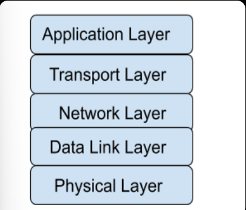

### Layers of TCP model:

1. Physical Layer:
- The physical layer translates message bits into signals for transmission on a medium, i.e. the physical layer is the place where the real communication takes place.
- Signals are generated depending on the type of media used to connect two devices. For example, electrical signals are generated for copper cables, light signals are generated for optical fibers, and radio waves are generated for air or vacuum.
- Physical layer also specifies characteristics like topology(bus,star,hybrid,mesh,ring), line configuration(point-to-point, multipoint) and transmission mode(simplex, half-duplex, full-duplex).

2. Data Link Layer(DLL):
- The DLL is subdivided into 2 layers: MAC(Media Access Control), LLC(Logical Link Control)
- The MAC layer is responsible for data encapsulation(Framing) of IP packets from the network layer into frames. Framing means DLL adds a header(which contains the MAC address of source and destination) and a trailer(which contains error-checking data) at the beginning and end of IP packets.
- LLC deals with flow control and error control. Flow control: Limits how much data a sender can transfer without overwhelming the receiver. Error Control: Error in the data transmission can be detected by checking the error detection bits in the trailer of the frame.

3. Network Layer:

The network layer adds IP address/logical address to the data segments to form IP packets and finds the best possible path for data delivery. IP addresses are addresses allocated to a device to uniquely identify it on a global scale. Common protocols used in the Network layer are

- IP(Internet Protocol): IP uses the receiver’s IP address to determine the best path for the proper delivery of packets to the destination. When a packet is too large to send over a network medium, the sender host's IP splits it up into smaller fragments. The fragments are reassembled into the original packet on the receiving host. IP is unreliable since it does not ensure delivery or check for errors.
- ARP(Address Resolution Protocol): ARP is used to find MAC/physical Addresses from the IP address.
- ICMP(Internet Control Message Protocol): ICMP is responsible for error reporting.

4. Transport Layer:

The transport layer is in charge of flow control (controlling the rate at which data is transferred), end-to-end connectivity, and error-free data transmission. Protocols used in the Transport layer:

- TCP(Transmission Control Protocol): 
- TCP is a connection-oriented protocol, which means it requires the formation and termination of connections between devices in order to transmit data.
- TCP segmentation means that at the sending node, TCP breaks the entire message into segments, assigns a sequence number to each segment, then reassembles the segments into the original message at the receiving end based on the sequence numbers.
- TCP is a reliable protocol because it identifies errors and retransmits the damaged frames, and ensures data delivery in the correct order.
- UDP(User Datagram Protocol):
- UDP is a connectionless protocol, which means it does not require the establishment and termination of connections between devices.
- UDP does not support segmentation and lacks error checking and correction which makes it less reliable but more cost-efficient.

5. Application Layer:

This is the uppermost layer, which combines the OSI model's session, presentation, and application layers. Users can interact with the application and access network resources through this layer.

Protocols used in the Application layer:

- HTTP(Hypertext Transfer Protocol): Protocol used to access data on the World Wide Web.
- DNS(Domain Name System): This protocol translates domain names to IP addresses.
- SMTP(Simple Mail Transfer Protocol): This protocol is used to send Email messages.
- FTP(File Transfer Protocol): This protocol is used to transfer files between computers.
- TELNET(Telecommunication Network): It is a two-way communication protocol connecting a local machine to a remote machine.

## What happens when you enter "google.com":

### Terms:
- WebPage: It is a text file formatted in a certain way so that the browser can understand it; This format is known as HTML. These files are located in computers that provide the service of storing. They are called servers because they serve the content that they hold.
- Servers: Web server serves the web pages. Application servers hold an application base code that will then be used to interact with web browser or other applications. Database servers hold a database that can be updated and consulted when needed.
- IP address: Address for client and server is IP address. It is a set of 4 numbers that range from 0 to 255 (one byte) separated by periods (i.e., 127.0.0.1).
- Protocols for Delivery: TCP or UDP. Each one of these determine the way the content of the server is served or delivered.
  1. TCP: TCP is usually used to deliver static websites such as Wikipedia or Google and also email services and to download files to your computer because TCP makes sure that all the content that is needed gets delivered. It accomplishes this by sending the file in small packets of data and along with each packet a confirmation to know that the packet was delivered; that's why if you are ever downloading something and your internet connection suddenly drops when it comes back up you don't have to start over because the server would know exactly how many packets you have and how many you still need to receive. The downside to TCP is that because it has to confirm whether you got the packet or not before sending the next, it tends to be slower.
  2. UDP: UDP, on the other hand, is usually used to serve live videos or online games. This is because UDP is a lot faster than TCP since UDP does not check if the information was received or not; it is not important. The only thing UDP cares about is sending the information. That is the reason why if you've ever watched a live video and if either your internet connection or the host's drops, you would just stop seeing the content; and when the connection comes back up you will only see the current stream of the broadcast and what was missed is forever lost. This is also true for online videogames.

 ### Process:

What happens when you type www.google.com or any other URL (Uniform Resource Locator) in your web browser and press Enter.

Flow:

Browser (cache) -> OS(host file) -> Resolver/Internet Service Provider -> root server (.com TLD(Top Level Domain)) -> authoritative name servers -> get the IP address.  

- So the first thing that happens is that your browser looks up in its cache to see if that website was visited before and the IP address is known. 

- If it can't find the IP address for the URL requested then it asks your operating system to locate the website. The first place your operating system is going to check for the address of the URL you specified is in the host file. If the URL is not found inside this file, then the OS will make a DNS request to find the IP Address of the web page.

- The first step is to ask the Resolver (or Internet Service Provider) server to look up its cache to see if it knows the IP Address, if the Resolver does not know then it asks the root server to ask the .COM TLD (Top Level Domain) server - if your URL ends in .net then the TLD server would be .NET and so on - the TLD server will again check in its cache to see if the requested IP Address is there. 

- If not, then it will have at least one of the authoritative name servers associated with that URL, and after going to the Name Server, it will return the IP Address associated with your URL. All this was done in a matter of milliseconds WOW!

- After the OS has the IP Address and gives it to the browser, it then makes a GET (a type of HTTP Method) to said IP Address. When the request is made the browser again makes the request to the OS which then, in turn, packs the request in the TCP traffic protocol we discussed earlier, and it is sent to the IP Address. 

- On its way, it is checked by both the OS' and the server's firewall to make sure that there are no security violations. And upon receiving the request the server (usually a load balancer that directs traffic to all available servers for that website) sends a response with the IP Address of the chosen server along with the SSL (Secure Sockets Layer) certificate to initiate a secure session (HTTPS). 

- Finally, the chosen server then sends the HTML, CSS, and Javascript files (If any) back to the OS who in turn gives it to the browser to interpret it. And then you get your website as you know it.

## What is Cache?

### Abstract
- Cache memory is nearest to the CPU and stores all the recent instructions. The term cache means a safe place for hiding and storing things.

### Definition
- Cache memory is a small fast memory that holds copies of recently accessed instructions and data. 
- The effectiveness of the cache mechanism is based on the property of locality of reference. It means many instructions for local areas of the program are executed repeatedly. The active segments of the program are placed in cache memory by reducing the total execution time. 
- When the processor makes a request for memory reference, the request is first sought in the cache. If we get the memory reference that is requested we call it “CACHE HIT” otherwise “CACHE MISS”.
- In the cache miss, the requested element is brought from a subsequent memory level from the memory hierarchy and placed in the cache.

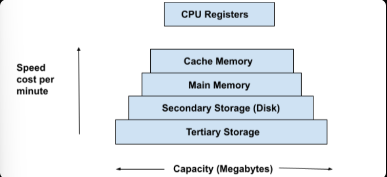

- A block of elements is transferred from main memory to cache memory by expecting that the next requested element will be residing in the neighboring locality of the current requested element (spatial locality) and this has to happen under one memory access time.
- The performance of cache memory is calculated in terms of hit ratio.
- Hit ratio = hit/(hit + miss) = no. of hits/ total access.
- Cache performance can be improved by using:
  1. Higher cache block size
  2. Higher associativity
  3. Reduce miss rate
  4. Reduce miss penalty
  5. Reduce the time to hit in the cache.

- Cache underlying principle is the locality of reference.
- In the locality of reference, huge data is placed in a small area (data which is needed) so that the access time will be less and the performance will be higher.
- The locality of reference is of two types:
  1. Spatial locality: The adjacent words in the block are referenced by the CPU  in the near future.
  2. Temporal locality: The same word in the block are referenced by the CPU in the near future 

- The cache is organized not in bytes but as blocks of cache lines with each line containing the same no. of bytes. (16-64)

- Cache lines do not have a fixed address, which enables the cache system to populate each cache line with a unique (non-contiguous) address. 

- There are three methods for filling a cache lines
  1. Fully associated - The most flexible.
  2. Direct mapped - The most basic
  3. Self associated - A combination of the two.

- This is a special memory used for speeding up the transfer of data and instruction.
- The cache stores the data and programs that are frequently used by the CPU. So any time some data is required it is first checked in the cache memory.

## Why does thrashing occur?

